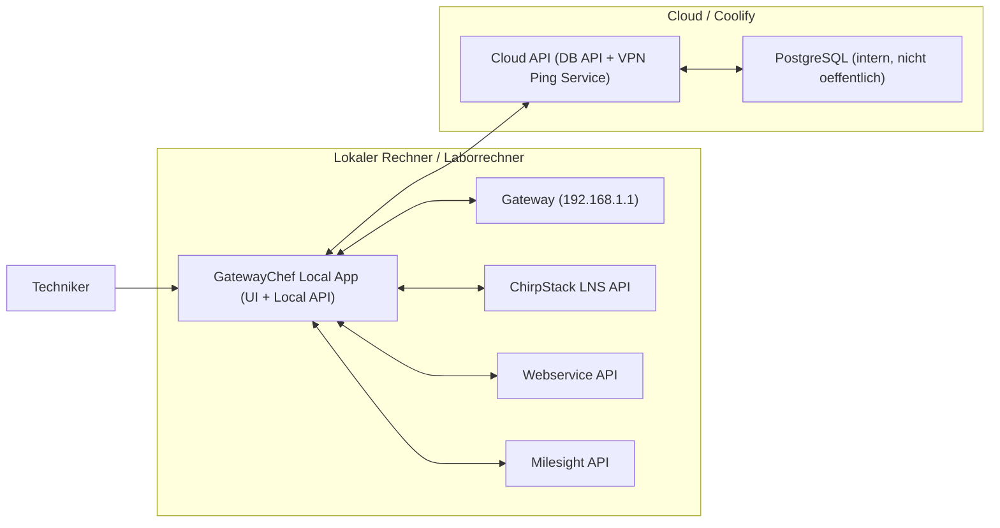

# Target Architecture: Local App + Cloud API

Stand: 2026-03-07

## 1) Zielbild

Die **GatewayChef App laeuft lokal** (Techniker/Laborrechner), weil sie direkt mit dem Gateway im lokalen Netz sprechen muss.

Die **Cloud (Coolify) stellt nur zentrale Dienste** bereit:
- DB-API
- VPN-Ping-Service
- interne PostgreSQL-Datenbank (nicht oeffentlich)

## 2) Architektur-Grafik

## 3) Was laeuft wo?

### Lokal
- GatewayChef UI + lokale API
- Direkte Aufrufe zu:
  - Gateway (`192.168.1.1`)
  - ChirpStack API
  - Webservice API
  - Milesight API
- Aufrufe zur Cloud API fuer:
  - DB lesen/schreiben
  - VPN Reachability Check

### Cloud (Coolify)
- Cloud API (dieses Projekt, cloud-mode)
- PostgreSQL als eigene Coolify DB-Resource
- Reverse Proxy (TLS / Domain Routing)

## 3.1 Code-Mapping im Repository (wo liegt was?)

### Gemeinsamer App-Entry (lokal + cloud)
- `app.py`
  - startet Flask
  - registriert je nach `APP_MODE` unterschiedliche Blueprints
  - `local`: UI + Gateway/ChirpStack/Milesight/Webservice + DB/Auth/Network
  - `cloud_api`: nur DB + Network

### Cloud API relevante Teile (DB + VPN service)
- `routes/db.py`
  - DB-Endpunkte (`/api/db/*`, `/api/sim/*`, `/api/provision`, `/api/confirm`)
  - in `cloud_api`: geschuetzt ueber `X-API-Token` (wenn `API_SERVICE_TOKEN` gesetzt)
- `routes/network.py`
  - `/api/network/ping-service` (cloud ping endpoint)
  - `/api/network/vpn-check` (proxy/local fallback logic)
- `utils/api_token.py`
  - `X-API-Token` Guard fuer Service-zu-Service Schutz
- `db/connection.py`
  - Postgres-Verbindung ueber `DB_*`
- `config.py`
  - `DB_API_PROVIDER_URL` fuer lokalen Proxy auf Cloud DB API
- `app.py`
  - `GET /api/version` fuer Deploy-/Version-Nachweis (`build_sha`, `build_tag`, `build_time`)
- `repositories/*` und `services/*`
  - Datenzugriff und Business-Logik hinter den DB-Endpunkten

### Lokale App relevante Teile (direkt mit Gateway/Services)
- `templates/index.html`
  - UI
- `static/js/workflow.js`, `static/js/main.js`, `static/js/ui.js`, `static/js/api.js`
  - Frontend-Workflow, Statusanzeige, API calls
- `routes/gateway.py`
  - direkte Kommunikation zum Gateway (`192.168.1.1`)
- `routes/chirpstack.py`
  - direkte ChirpStack API Aufrufe
- `routes/milesight.py`
  - direkte Milesight API Aufrufe
- `routes/webservice.py`
  - direkte Webservice API Aufrufe

### Deployment/Operations
- `Dockerfile`
  - cloud container build/start
- `docker-compose.yml`
  - lokale Container-Entwicklung (app + db)
- `scripts/migrate.py`
  - DB schema migration
- `scripts/import_legacy_dump.sh`
  - einmaliger Datenimport alt -> neu
- `scripts/smoke_test.sh`
  - API smoke tests

## 4) Docker/Coolify Umsetzung

## 4.1 App-Container (Cloud API)
- Dockerfile expose: `5000`
- Prozess: `python app.py`
- Muss laufen mit:
  - `HOST=0.0.0.0`
  - `PORT=5000`

## 4.2 DB-Container (Coolify PostgreSQL)
- Eigene Resource in Coolify anlegen
- Interner Port: `5432`
- **Nicht oeffentlich exposen**

## 4.3 Reverse Proxy
- Extern: `https://<cloud-api-domain>`
- Proxy-Target intern: App-Container Port `5000`
- `503` bedeutet meist:
  - App startet nicht
  - oder App hoert nicht auf `PORT=5000` / `HOST=0.0.0.0`

## 5) Wichtige Variablen (klar getrennt)

### 5.1 Cloud API (Coolify App)
Diese setzt du in der Cloud-App:
- `APP_MODE=cloud_api`
- `DB_HOST=<interner coolify-db-service-name>`
- `DB_PORT=5432`
- `DB_NAME=<new_db_name>`
- `DB_USER=<new_db_user>`
- `DB_PASSWORD=<new_db_password>`
- `HOST=0.0.0.0`
- `PORT=5000`
- `OPEN_BROWSER=false`
- `FLASK_DEBUG=false`
- `API_SERVICE_TOKEN=<shared-token-local-cloud>`
- `VPN_PING_SERVICE_TOKEN=<shared-token>`

Cloud-Scope im Zielzustand:
- DB API (`/api/db/*`, `/api/sim/*`, `/api/provision`, `/api/confirm`)
- VPN Ping Service (`/api/network/ping-service`, `/api/network/vpn-check`)
- interne PostgreSQL-Anbindung

### 5.2 Lokale App
Diese setzt du lokal:
- `APP_MODE=local`
- `PORT=5011` (oder dein lokaler Wunschport)
- `HOST=0.0.0.0`
- `FLASK_DEBUG=true`
- `OPEN_BROWSER=true`
- `VPN_PING_PROVIDER_URL=https://<cloud-api-domain>`
- `VPN_PING_SERVICE_TOKEN=<same-shared-token-as-cloud>`
- `DB_API_PROVIDER_URL=https://<cloud-api-domain>`
- `DB_API_TIMEOUT_SECS=10`
- `API_SERVICE_TOKEN=<same-shared-token-as-cloud>`

Zielzustand:
- Lokale App spricht direkt mit Gateway/ChirpStack/Milesight/Webservice.
- Lokale App spricht fuer DB-Endpunkte ueber den lokalen Backend-Proxy zur Cloud API.
- Direkte lokale DB-Verbindung ist nur Fallback/Dev-Modus ohne `DB_API_PROVIDER_URL`.

### 5.3 Nur fuer Datenmigration (einmalig)
Nicht fuer normalen Betrieb:
- `SOURCE_DATABASE_URL=postgresql://<old...>` (alte DB)
- `TARGET_DATABASE_URL=postgresql://<new...>` (neue DB)

## 6) Migration alt -> neu (Betriebssicht)

1. Neue DB in Coolify anlegen.
2. Cloud API auf neue DB-`DB_*` konfigurieren.
3. Daten von alter DB in neue DB importieren (`import_legacy_dump.sh`).
4. Smoke-Test gegen Cloud API.
5. Lokale App auf Cloud API endpoint fuer DB/VPN Checks stellen.
6. Alte DB nicht mehr fuer laufenden Traffic nutzen.

## 7) Security: Token vs User-Management

Fuer **Cloud API nur fuer System-zu-System** (lokale App <-> Cloud API) ist ein
**Token-basiertes Modell** meist sinnvoller als volles User-Management:

Empfehlung:
- Kurzfristig: Shared service token (z. B. `X-API-Token` / `X-Ping-Service-Token`)
- Mittelfristig: Rotierbare API keys pro Standort/Client
- Langfristig (wenn externe Nutzer/mandantenfaehig): JWT/OAuth + Rollenmodell

Pragmatisches Fazit fuer euren Fall:
- Ja, Token-first ist hier der richtige Start.
- Volles User-Management nur einfuehren, wenn echte Benutzerkonten, Rollen und Self-Service noetig werden.

## 7.1 Token-Regeln (kurz und eindeutig)

- `API_SERVICE_TOKEN`:
  - muss in **Lokaler App** und **Cloud API** gleich sein
  - in Cloud: schuetzt DB-nahe Endpunkte
  - in Lokal: wird beim DB-Proxy als `X-API-Token` an Cloud weitergereicht

- `VPN_PING_SERVICE_TOKEN`:
  - muss in **Lokaler App** und **Cloud API** gleich sein
  - schuetzt `/api/network/ping-service`

- `JWT_SECRET`:
  - betrifft nur lokale Auth-Endpunkte
  - ist fuer den Cloud-Zielscope (DB API + VPN Ping) nicht erforderlich

## 8) Checkliste gegen Verwirrung

- Lokal muss Gateway erreichen koennen -> App bleibt lokal.
- Cloud muss DB sichern/zentralisieren -> DB nur intern.
- Reverse Proxy exponiert nur API-App, nie DB.
- `DB_*` fuer Betrieb zeigen auf neue DB.
- `SOURCE_/TARGET_DATABASE_URL` nur fuer einmaligen Import.

## 9) Legacy-Feldmapping (Vollstaendigkeit)

Quelle Legacy-Felder:
- SQL-Verwendung in `/Users/jochen/bb/projects/milesight_lora_gw_config/provisioner/routes/db.py`
- Payload-Verwendung in `static/js/workflow.js` (lokale App)

| Legacy field | New DB column | API endpoint(s) | Used by local app |
|---|---|---|---|
| `sim_vendors.id` | `sim_vendors.id` | `GET /api/sim/vendors` | ja (Select value) |
| `sim_vendors.vendor_name` | `sim_vendors.vendor_name` | `GET /api/sim/vendors` | ja (Anzeige) |
| `sim_vendors.apn` | `sim_vendors.apn` | `GET /api/sim/vendors`, `POST /api/provision` | ja (APN Zielwert) |
| `sim_cards.id` | `sim_cards.id` | `POST /api/sim/next`, `POST /api/db/gateway`, `POST /api/db/customer-update`, `POST /api/provision` | ja (`simCardId`) |
| `sim_cards.vendor_id` | `sim_cards.vendor_id` | `POST /api/sim/next`, `POST /api/db/gateway`, `POST /api/db/customer-update`, `POST /api/provision` | ja (`simVendor`) |
| `sim_cards.iccid` | `sim_cards.iccid` | `POST /api/sim/next`, `POST /api/db/gateway`, `POST /api/db/customer-update`, `POST /api/provision` | ja (`simIccid`) |
| `sim_cards.sim_id` | `sim_cards.sim_id` | `POST /api/sim/next`, `POST /api/db/gateway`, `POST /api/db/customer-update` | ja (Webservice payload) |
| `sim_cards.assigned_gateway_id` | `sim_cards.assigned_gateway_id` | intern in `assign_sim` (Zuordnung) | indirekt |
| `sim_cards.assigned_at` | `sim_cards.assigned_at` | intern in `assign_sim` (Zeitstempel) | indirekt |
| `gateway_inventory.vpn_ip` | `gateway_inventory.vpn_ip` | `GET /api/db/fetch-ip`, `POST /api/db/vpn-key`, `POST /api/db/gateway`, `POST /api/db/customer-update`, `POST /api/provision`, `POST /api/confirm` | ja |
| `gateway_inventory.private_key` | `gateway_inventory.private_key` | `GET /api/db/fetch-ip`, `POST /api/db/vpn-key` | ja (VPN key UI) |
| `gateway_inventory.eui` | `gateway_inventory.eui` | `POST /api/db/gateway`, `POST /api/provision` | ja |
| `gateway_inventory.wifi_ssid` | `gateway_inventory.wifi_ssid` | `POST /api/db/gateway`, `POST /api/provision` | ja |
| `gateway_inventory.serial_number` | `gateway_inventory.serial_number` | `POST /api/db/vpn-key`, `POST /api/db/gateway`, `POST /api/db/customer-update`, `POST /api/provision` | ja |
| `gateway_inventory.gateway_name` | `gateway_inventory.gateway_name` | `POST /api/db/gateway`, `POST /api/db/customer-update`, `POST /api/provision` | ja |
| `gateway_inventory.status_overall` | `gateway_inventory.status_overall` | `GET /api/db/fetch-ip`, `POST /api/db/gateway`, `POST /api/db/customer-update`, `POST /api/confirm`, `POST /api/provision` | ja (Anzeige/Gating) |
| `gateway_inventory.sim_card_id` | `gateway_inventory.sim_card_id` | `POST /api/db/gateway`, `POST /api/db/customer-update`, `POST /api/provision` | ja |
| `gateway_inventory.wifi_ip` | `gateway_inventory.wifi_ip` | `POST /api/provision` | ja |
| `gateway_inventory.apn` | `gateway_inventory.apn` | `POST /api/provision` | ja |
| `gateway_inventory.cellular_status` | `gateway_inventory.cellular_status` | `POST /api/provision` | ja |
| `gateway_inventory.lte_connected` | `gateway_inventory.lte_connected` | `POST /api/provision` | ja |
| `gateway_inventory.cellular_ip` | `gateway_inventory.cellular_ip` | `POST /api/provision` | ja |
| `gateway_inventory.vpn_key_present` | `gateway_inventory.vpn_key_present` | `POST /api/provision` | ja |
| `gateway_inventory.gateway_vendor` | `gateway_inventory.gateway_vendor` | `POST /api/provision` | ja |
| `gateway_inventory.gateway_model` | `gateway_inventory.gateway_model` | `POST /api/provision` | ja |
| `gateway_inventory.lora_gateway_eui` | `gateway_inventory.lora_gateway_eui` | `POST /api/provision` | ja |
| `gateway_inventory.lora_gateway_id` | `gateway_inventory.lora_gateway_id` | `POST /api/provision` | ja |
| `gateway_inventory.lora_active_server` | `gateway_inventory.lora_active_server` | `POST /api/provision` | ja |
| `gateway_inventory.lora_status` | `gateway_inventory.lora_status` | `POST /api/provision` | ja |
| `gateway_inventory.lora_pending` | `gateway_inventory.lora_pending` | `POST /api/provision` | ja |
| `gateway_inventory.conf_gateway_done` | `gateway_inventory.conf_gateway_done` | `POST /api/provision` (set true) | indirekt |
| `gateway_inventory.assigned_at` | `gateway_inventory.assigned_at` | `POST /api/provision` (set now) | indirekt |
| `gateway_inventory.last_gateway_sync_at` | `gateway_inventory.last_gateway_sync_at` | `POST /api/provision` (set now) | indirekt |

Pruefergebnis:
- Kein stilles Feld-Dropping zwischen Legacy-Routen und neuem Schema/API festgestellt.
- `final_check_ok` wird im Payload mitgeschickt, aber wie bereits in der Original-App nicht persistiert.
