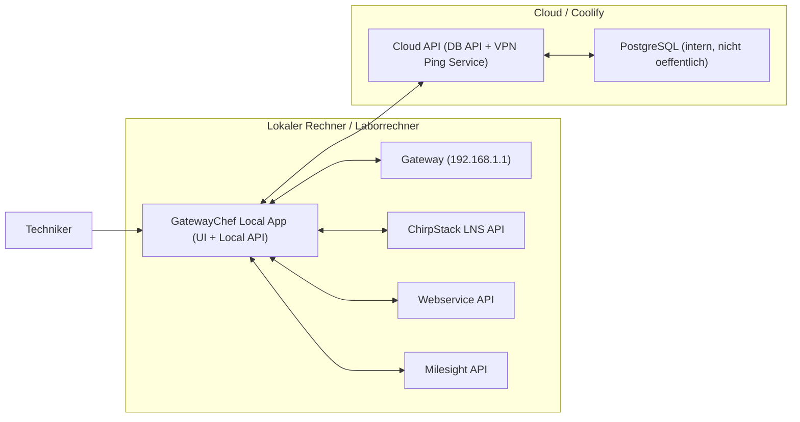

# Target Architecture: Local App + Cloud API

Stand: 2026-03-06

## 1) Zielbild

Die **GatewayChef App laeuft lokal** (Techniker/Laborrechner), weil sie direkt mit dem Gateway im lokalen Netz sprechen muss.

Die **Cloud (Coolify) stellt nur zentrale Dienste** bereit:
- DB-API
- VPN-Ping-Service
- interne PostgreSQL-Datenbank (nicht oeffentlich)

## 2) Architektur-Grafik

## 3) Was laeuft wo?

### Lokal
- GatewayChef UI + lokale API
- Direkte Aufrufe zu:
  - Gateway (`192.168.1.1`)
  - ChirpStack API
  - Webservice API
  - Milesight API
- Aufrufe zur Cloud API fuer:
  - DB lesen/schreiben
  - VPN Reachability Check

### Cloud (Coolify)
- Cloud API (dieses Projekt, cloud-mode)
- PostgreSQL als eigene Coolify DB-Resource
- Reverse Proxy (TLS / Domain Routing)

## 3.1 Code-Mapping im Repository (wo liegt was?)

### Gemeinsamer App-Entry (lokal + cloud)
- `app.py`
  - startet Flask
  - registriert alle Blueprints (`routes/*`)
  - gleiches Entry fuer lokalen und cloud Betrieb

### Cloud API relevante Teile (DB + VPN service)
- `routes/db.py`
  - DB-Endpunkte (`/api/db/*`, `/api/sim/*`, `/api/provision`, `/api/confirm`)
  - ist der zentrale DB-API Layer
- `routes/network.py`
  - `/api/network/ping-service` (cloud ping endpoint)
  - `/api/network/vpn-check` (proxy/local fallback logic)
- `utils/api_token.py`
  - `X-API-Token` Guard fuer Service-zu-Service Schutz
- `db/connection.py`
  - Postgres-Verbindung ueber `DB_*`
- `repositories/*` und `services/*`
  - Datenzugriff und Business-Logik hinter den DB-Endpunkten

### Lokale App relevante Teile (direkt mit Gateway/Services)
- `templates/index.html`
  - UI
- `static/js/workflow.js`, `static/js/main.js`, `static/js/ui.js`, `static/js/api.js`
  - Frontend-Workflow, Statusanzeige, API calls
- `routes/gateway.py`
  - direkte Kommunikation zum Gateway (`192.168.1.1`)
- `routes/chirpstack.py`
  - direkte ChirpStack API Aufrufe
- `routes/milesight.py`
  - direkte Milesight API Aufrufe
- `routes/webservice.py`
  - direkte Webservice API Aufrufe

### Deployment/Operations
- `Dockerfile`
  - cloud container build/start
- `docker-compose.yml`
  - lokale Container-Entwicklung (app + db)
- `scripts/migrate.py`
  - DB schema migration
- `scripts/import_legacy_dump.sh`
  - einmaliger Datenimport alt -> neu
- `scripts/smoke_test.sh`
  - API smoke tests

## 4) Docker/Coolify Umsetzung

## 4.1 App-Container (Cloud API)
- Dockerfile expose: `5000`
- Prozess: `python app.py`
- Muss laufen mit:
  - `HOST=0.0.0.0`
  - `PORT=5000`

## 4.2 DB-Container (Coolify PostgreSQL)
- Eigene Resource in Coolify anlegen
- Interner Port: `5432`
- **Nicht oeffentlich exposen**

## 4.3 Reverse Proxy
- Extern: `https://<cloud-api-domain>`
- Proxy-Target intern: App-Container Port `5000`
- `503` bedeutet meist:
  - App startet nicht
  - oder App hoert nicht auf `PORT=5000` / `HOST=0.0.0.0`

## 5) Wichtige Variablen (klar getrennt)

### 5.1 Cloud API (Coolify App)
Diese setzt du in der Cloud-App:
- `APP_MODE=cloud_api`
- `DB_HOST=<interner coolify-db-service-name>`
- `DB_PORT=5432`
- `DB_NAME=<new_db_name>`
- `DB_USER=<new_db_user>`
- `DB_PASSWORD=<new_db_password>`
- `HOST=0.0.0.0`
- `PORT=5000`
- `OPEN_BROWSER=false`
- `FLASK_DEBUG=false`
- `JWT_SECRET=<secret>`
- `JWT_ALGORITHM=HS256`
- `JWT_EXPIRES_HOURS=24`
- `VPN_PING_SERVICE_TOKEN=<shared-token>`

Optional (wenn Cloud API auch externen Services spricht):
- `CHIRPSTACK_*`, `MILESIGHT_*`, `GATEWAY_*`

### 5.2 Lokale App
Diese setzt du lokal:
- `APP_MODE=local`
- `PORT=5011` (oder dein lokaler Wunschport)
- `HOST=0.0.0.0`
- `FLASK_DEBUG=true`
- `OPEN_BROWSER=true`
- `VPN_PING_PROVIDER_URL=https://<cloud-api-domain>`
- `VPN_PING_SERVICE_TOKEN=<same-shared-token-as-cloud>`

Wenn lokale App direkt zur DB spricht (Uebergangsmodus), dann lokal auch `DB_*`.
Zielzustand: lokale App soll fuer DB nur noch Cloud API nutzen.

### 5.3 Nur fuer Datenmigration (einmalig)
Nicht fuer normalen Betrieb:
- `SOURCE_DATABASE_URL=postgresql://<old...>` (alte DB)
- `TARGET_DATABASE_URL=postgresql://<new...>` (neue DB)

## 6) Migration alt -> neu (Betriebssicht)

1. Neue DB in Coolify anlegen.
2. Cloud API auf neue DB-`DB_*` konfigurieren.
3. Daten von alter DB in neue DB importieren (`import_legacy_dump.sh`).
4. Smoke-Test gegen Cloud API.
5. Lokale App auf Cloud API endpoint fuer DB/VPN Checks stellen.
6. Alte DB nicht mehr fuer laufenden Traffic nutzen.

## 7) Security: Token vs User-Management

Fuer **Cloud API nur fuer System-zu-System** (lokale App <-> Cloud API) ist ein
**Token-basiertes Modell** meist sinnvoller als volles User-Management:

Empfehlung:
- Kurzfristig: Shared service token (z. B. `X-API-Token` / `X-Ping-Service-Token`)
- Mittelfristig: Rotierbare API keys pro Standort/Client
- Langfristig (wenn externe Nutzer/mandantenfaehig): JWT/OAuth + Rollenmodell

Pragmatisches Fazit fuer euren Fall:
- Ja, Token-first ist hier der richtige Start.
- Volles User-Management nur einfuehren, wenn echte Benutzerkonten, Rollen und Self-Service noetig werden.

## 7.1 Token-Regeln (kurz und eindeutig)

- `API_SERVICE_TOKEN`:
  - muss in **Lokaler App** und **Cloud API** gleich sein
  - schuetzt DB-nahe Cloud API Endpunkte (`/api/db*`, `/api/sim*`, `/api/provision`, `/api/confirm`)

- `VPN_PING_SERVICE_TOKEN`:
  - muss in **Lokaler App** und **Cloud API** gleich sein
  - schuetzt `/api/network/ping-service`

- `JWT_SECRET`:
  - ist **separat** und fuer User-Login/JWT-Endpunkte (`/api/auth/*`)
  - fuer den aktuellen Zielbetrieb (Cloud API nur fuer DB/Ping) optional
  - muss nicht identisch zwischen Lokal und Cloud sein, solange keine JWTs zwischen beiden Instanzen geteilt werden

## 8) Checkliste gegen Verwirrung

- Lokal muss Gateway erreichen koennen -> App bleibt lokal.
- Cloud muss DB sichern/zentralisieren -> DB nur intern.
- Reverse Proxy exponiert nur API-App, nie DB.
- `DB_*` fuer Betrieb zeigen auf neue DB.
- `SOURCE_/TARGET_DATABASE_URL` nur fuer einmaligen Import.
