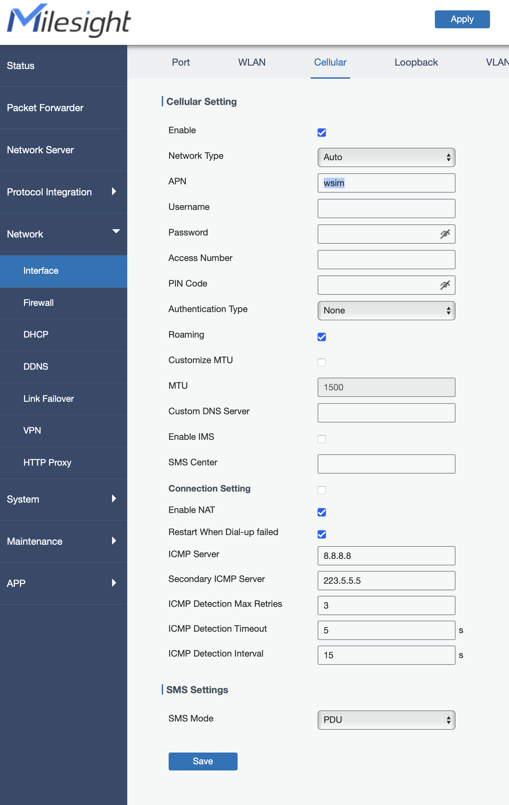

# APN setzen

Der APN wird aus dem SIM Vendor abgeleitet und muss im Gateway gesetzt sein.

1) Gehe im Gateway UI (eventuell musst du dich erst einloggen) zu 'Network->Interfaces'. 
Öffne dort den Tab 'Cellular' (oben).

2) Trage den APN exakt wie vorgegeben (und vorher kopiert) ein und speichere.

3) **Wichtig** `Speichern* unten und dann "Apply* oben drücken.

