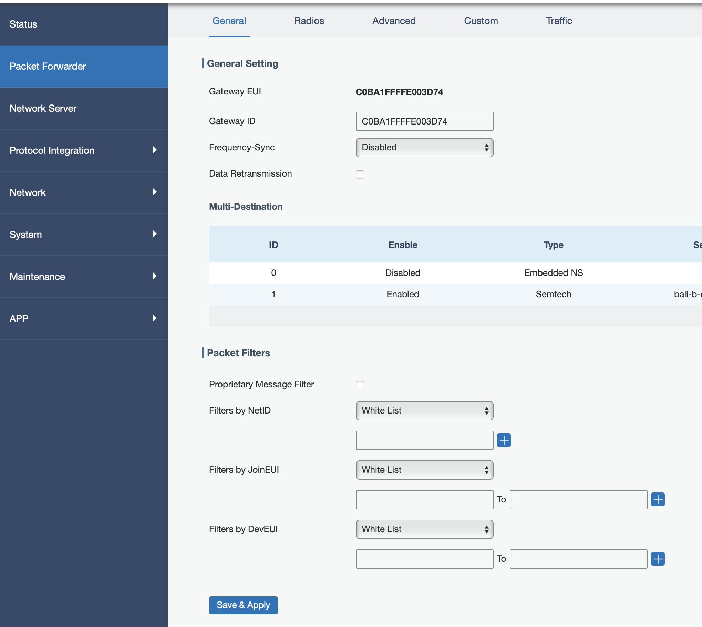

# Gateway ID setzen

Die Gateway ID muss der erwarteten EUI entsprechen.

1) Klicke auf 'Copy & Open' in der Zeile für die Gateway ID.

2) Öffne folgendes Bild im Gateway UI (eventuell musst du dich erst einloggen) und setze im 'Packet Forwarder' die Gateway ID auf denselben Wert wie die Gateway EUI. Einfach durch einfügen des kopierten Wertes.

2) **Wichtig!** Klicke auf 'Save & Apply'! Trage die erwartete Gateway ID ein und speichere.
