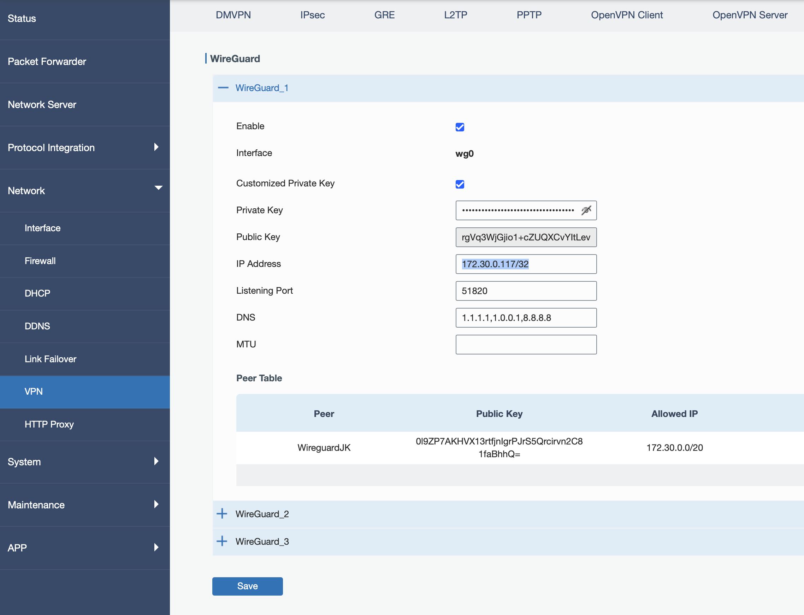
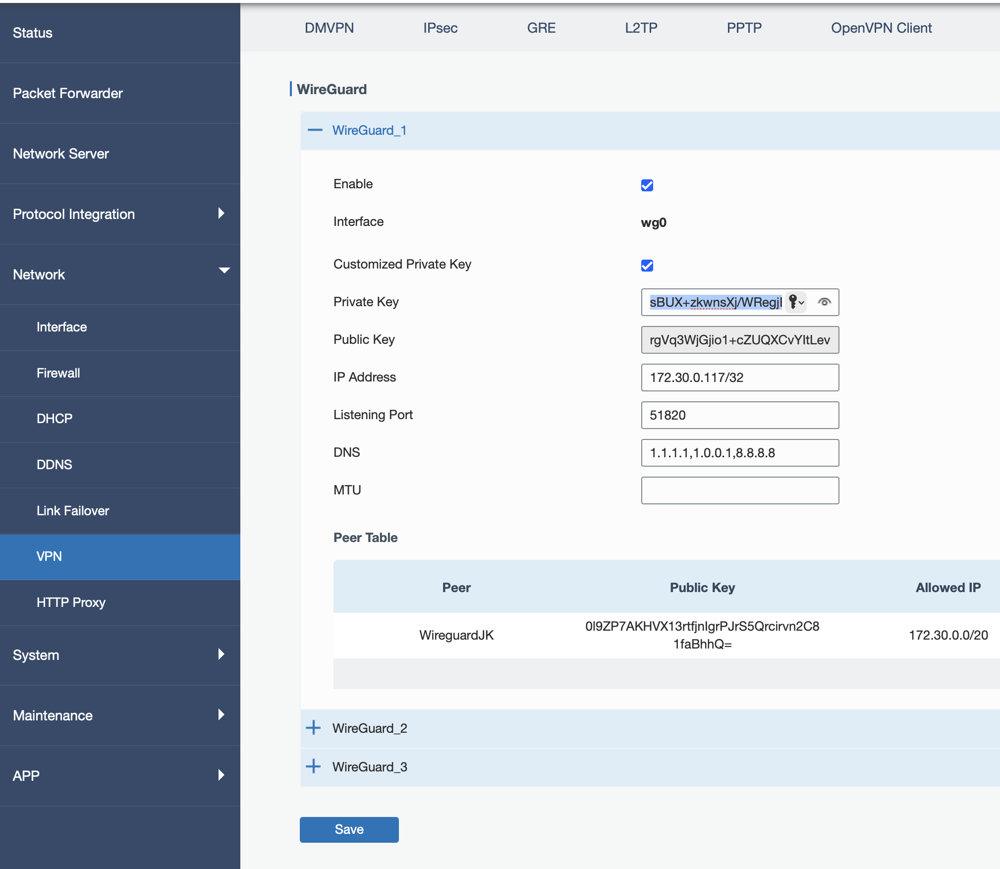
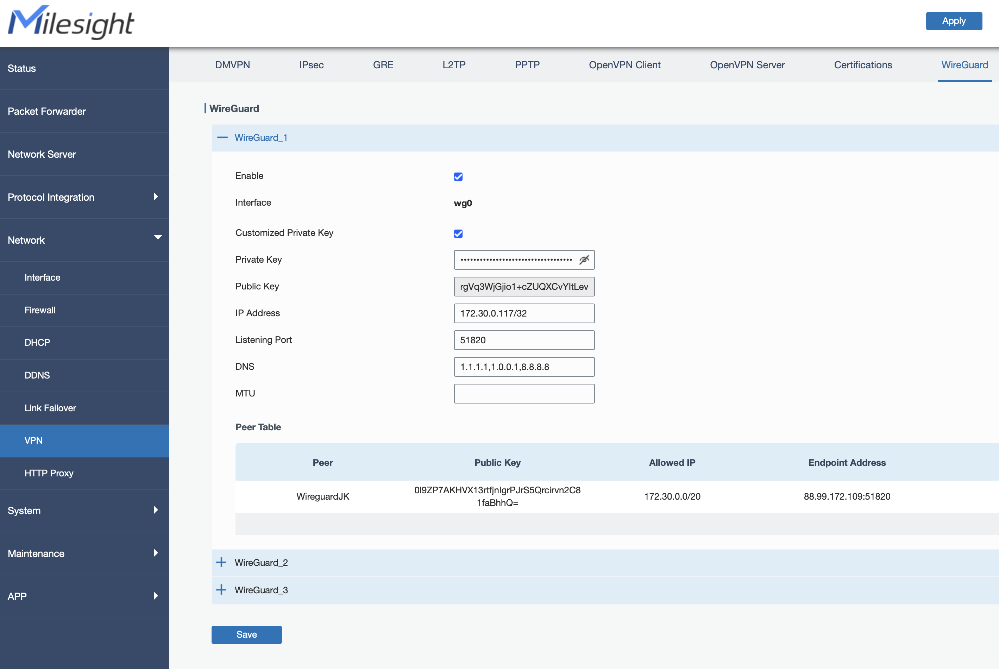

# VPN IP setzen

Stelle sicher, dass die VPN IP korrekt gesetzt ist.

1) Klicke auf 'Copy & Open' in der Zeile für die VPN IP (Gateway).

2) Gehe im Gateway UI (eventuell musst du dich erst einloggen) zu 'Network->VPN'. 
Öffne dort den Tab 'WireGuard' (oben).

3) Füge die zuvor kopierte VPN IP ein.

4) Kopiere im **GatewayChef** den 'VPN Private Key' und füge diesen ein. Mache dazu erst das Feld sichtbar, lösche den alten Key und füge ein. (Einfügen durch sichtbar machen, 3x schnell klicken und dann einfügen ist auch möglich)

5) **Wichtig** `Speichern* unten und dann "Apply* oben drücken.

