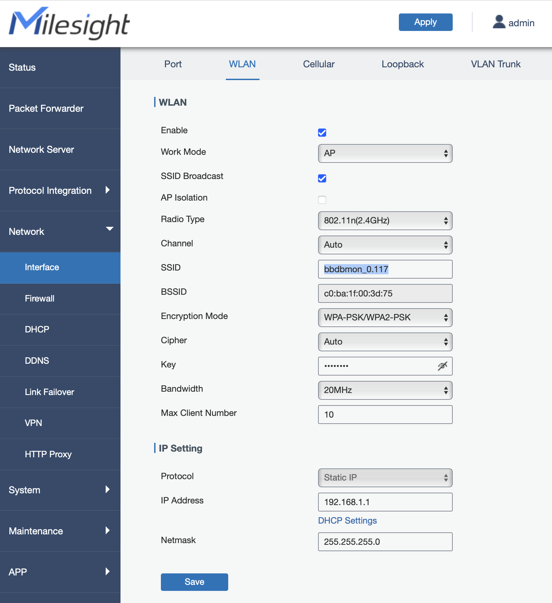

# WLAN SSID setzen

Die SSID muss zur VPN IP passen (z.B. `bbdbmon_0.119`).

1) Klicke auf 'Copy & Open' in der Zeile für die WiFi SSID.

2) Gehe im Gateway UI (eventuell musst du dich erst einloggen) zu 'Network->Interfaces'. 
Öffne dort den Tab 'WLAN' (oben).

3) Füge die zuvor kopierte 'WiFi SSID' ein.

4) **Wichtig** `Speichern* unten und dann "Apply* oben drücken.

